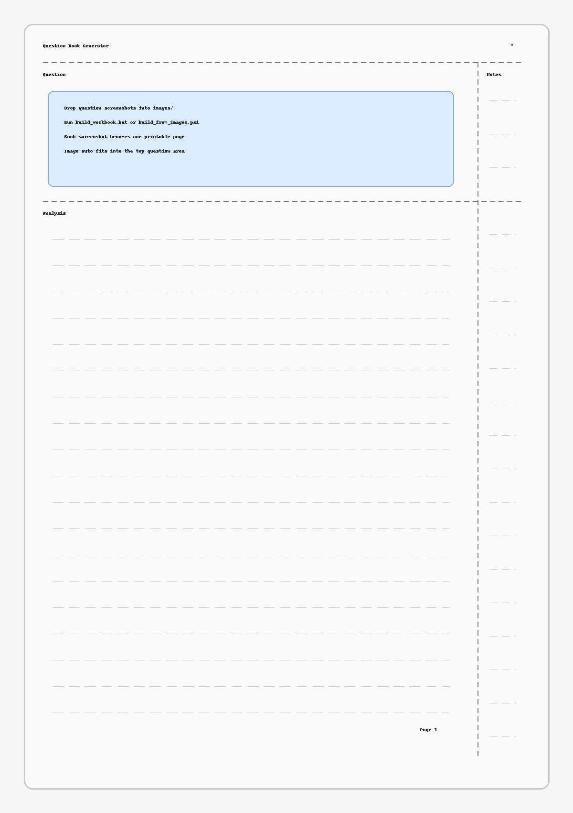

# Question Book Generator

把题目截图批量排版成“一页一题”的可打印做题本。

Generate a printable one-question-per-page workbook PDF directly from question screenshots.



这个项目适合这样的场景：

- 平时把题目保存成图片
- 想快速整理成可打印 PDF
- 不想做 OCR，也不想手动排版

生成后的页面结构：

- 上方固定题目区
- 右侧笔记区
- 下方解析区
- 一页一题

## Features

- 直接读取 `images/` 里的题目图片
- 默认按时间顺序排版
- 自动缩放图片到固定题目区
- Windows 下支持双击一键生成
- 使用 `XeLaTeX` 输出 PDF

## Requirements

- Windows
- Python 3
- TeX Live with `xelatex`

已测试命令：

```powershell
python --version
xelatex --version
```

Python 依赖：

```powershell
pip install pillow
```

## Quick Start

1. 把题目图片放进 [images/](./images)
2. 双击 [build_workbook.bat](./build_workbook.bat)
3. 生成结果在 [main.pdf](./main.pdf)

命令行方式：

```powershell
powershell -ExecutionPolicy Bypass -File .\build_from_images.ps1
```

## Files

- `images/`: 存放题目图片
- `main.tex`: LaTeX 模板
- `generate_questions.py`: 生成 `questions_generated.tex`
- `build_from_images.ps1`: 生成并编译 PDF
- `build_workbook.bat`: Windows 双击入口

## Supported Image Formats

- `.png`
- `.jpg`
- `.jpeg`
- `.bmp`
- `.webp`
- `.pdf`

## Notes

- 默认不裁白边，避免截图变糊。
- 默认按图片时间顺序排版。
- 如果文件名前面带数字，也可以切换成按文件名数字编号。

示例命令：

```powershell
powershell -ExecutionPolicy Bypass -File .\build_from_images.ps1 -UseFilenameNumber
```

## License

当前仓库附带 MIT License。发布前如果你想换成别的许可证，可以直接修改 [LICENSE](./LICENSE)。
